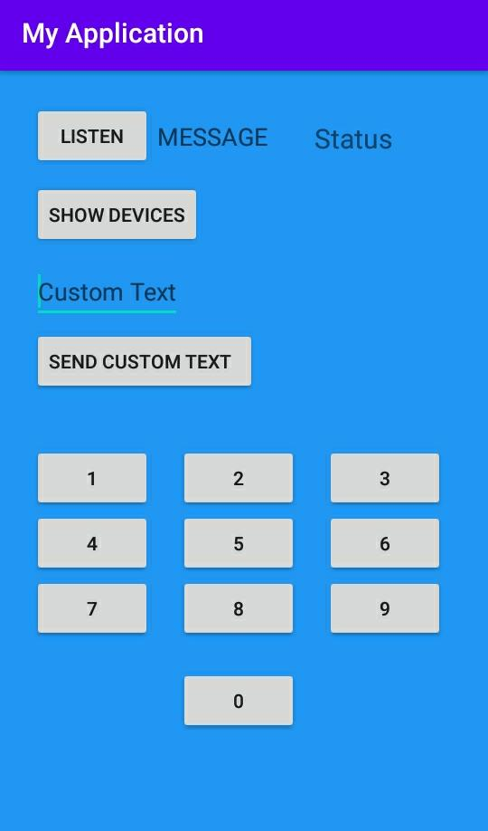

# Bluetooth Chat Application Android
A simple bluetooth chat application developed on Android Studio.  
On start up, the app requests permission to switch on bluetooth. 
One device lists all the once-paired devices. And connects to a particular device from the list.  
The other device listens for incoming connection request and then both the devices get connected.  
Tapping on the number sends the number directly. A custom text message can also be sent by typing in the EditText and then tapping the send custom message button.

 # In Action:
This is the main page in the app

# Authors:
Srinidhi Ayyagari

# Acknowledgement:
Would like to thank all the resources on Youtube and Stack Overflow always! :)

